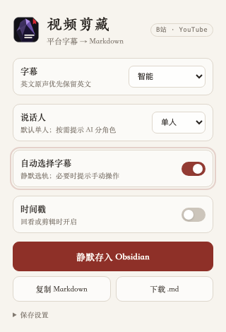

# Obsidian Video Transcript Clipper

> B站 / YouTube / 小鹅通字幕剪藏到 Obsidian 的 Chrome 扩展


A privacy-first Chrome extension that extracts platform-provided **Bilibili subtitles**, **YouTube transcripts**, and available **Xiaoe captions**, converts them into clean Markdown, and saves them to Obsidian for AI-assisted learning.

[下载最新版 / Download latest release](https://github.com/aibuqin-code/obsidian-video-transcript-clipper/releases/latest)



## Why this project

Most web clippers save pages. This extension is specialized for a different workflow:

```text
platform captions → language selection → transcript cleanup → Markdown → Obsidian / AI
```

It does **not** download full videos or run a local speech-recognition model. If a platform does not provide a readable subtitle track, the extension stops and explains why.

## Features

- Bilibili AI/manual subtitle extraction.
- YouTube caption and transcript extraction.
- Experimental read-only detection of existing Xiaoe subtitle tracks.
- Smart language policy:
  - Chinese-original video → Chinese transcript.
  - English-original video → English evidence track.
  - English original + Chinese track/translation → bilingual Markdown.
  - Chinese translation never replaces the English original.
- Modes: Smart, 中文, English, bilingual, and follow-player.
- Speaker context: single (default), two-person, or multi-person. AI speaker instructions are emitted only when the user selects two or multi.
- Optional timestamps, disabled by default.
- Copy Markdown, download `.md`, preview, or write through Obsidian Local REST API without switching applications.
- No private subtitle backend, analytics, account export, or full-video download.

## Install

1. Download the latest ZIP from [Releases](https://github.com/aibuqin-code/obsidian-video-transcript-clipper/releases/latest).
2. Extract it to a stable local folder.
3. Open `chrome://extensions/`.
4. Enable **Developer mode**.
5. Click **Load unpacked** and select the folder containing `manifest.json`.
6. Open the extension’s **保存设置** and enter your own target folder and Local REST API connection details.

Do not move or delete the unpacked folder while the extension is installed.

### Enable true background saving

The normal `obsidian://` URI can activate the Obsidian application even when a “silent” parameter is present. To keep the browser in front, this extension uses the open-source [Obsidian Local REST API](https://github.com/coddingtonbear/obsidian-local-rest-api) plugin instead.

1. Install and enable **Local REST API** in Obsidian.
2. In its settings, enable the loopback HTTP server (`http://127.0.0.1:27123`).
3. Copy its API key into this extension’s collapsed **保存设置** panel.
4. Click **测试后台连接** once.

The key is stored only in the current Chrome profile. Requests are restricted to `127.0.0.1` or `localhost`; the extension does not send the key or transcript to a remote server.

## Supported behavior

| Platform | With platform captions | Without captions |
| --- | --- | --- |
| Bilibili | Extract Chinese/manual/AI subtitle tracks | Show a clear no-track message |
| YouTube | Preserve original captions; bilingual output when available | Show a clear no-caption message |
| Xiaoe | Experimental detection of existing TextTrack/VTT/JSON captions | Stop; no ASR or media download |

## Markdown output

Each note records source URL, platform, video ID, author/channel, capture time, subtitle source, primary language, optional translation language, timestamp mode, speaker mode, description source/quality, and a raw-evidence boundary.

Single-speaker mode is the default and does not ask AI to invent roles. When two-person or multi-person mode is selected, the note tells downstream AI to begin with provisional `Speaker A / B / C` labels, attach real names only when the transcript supports them, and mark uncertain turns rather than guessing. See [`video-transcript-v1`](docs/video-transcript-processing-rule.md).

New notes enter the knowledge workflow as `processing_status: pending` and contain a portable Obsidian link to `[[视频逐字稿处理规则]]`. Users can later say “process this”, “discuss this video”, or similar natural language: the shared rule separates a readable derivative, a no-write conversation, and a durable source interpretation while preserving the raw transcript.

Background saves are acknowledged only after an authenticated write and exact read-back verification. Identical files are not duplicated. If the target path exists with different content, the extension creates a numbered sibling instead of overwriting it.

Video descriptions prefer platform-native fields: Bilibili video-detail data and YouTube `videoDetails.shortDescription`. Page Meta is only a fallback and is visibly marked; known Bilibili playback-statistics and recommendation pollution is trimmed. Author-written links to earlier videos remain part of the original description.

The extension only normalizes whitespace and consecutive duplicates; it does not mix summaries or AI-generated claims into the transcript.

## Privacy

See [PRIVACY.md](PRIVACY.md). The distributable source contains no personal Vault ID, Local REST API key, account, email, absolute local path, browser history, real course transcript, private token, or third-party quota.

## Development

```bash
npm test
```

The current suite covers REST authentication boundaries, loopback-only URLs, write/read-back verification, duplicate and conflict handling, transcript cleanup, timestamps, pending-processing metadata, speaker-mode boundaries, description contamination, bilingual alignment, language protection, platform detection, Bilibili subtitle resources, YouTube caption metadata/JSON3, and Xiaoe timed-text parsing.

## Limitations

- Hardcoded subtitles burned into video frames require OCR and are not supported.
- Platform UI and internal caption APIs may change.
- Xiaoe support is experimental because subtitle availability depends on the merchant/course configuration.
- True background saving requires Obsidian to be running with Local REST API enabled. Copy and download remain available without it.
- This extension does not bypass login, payment, access control, or DRM.

## License

MIT. See [LICENSE](LICENSE).
